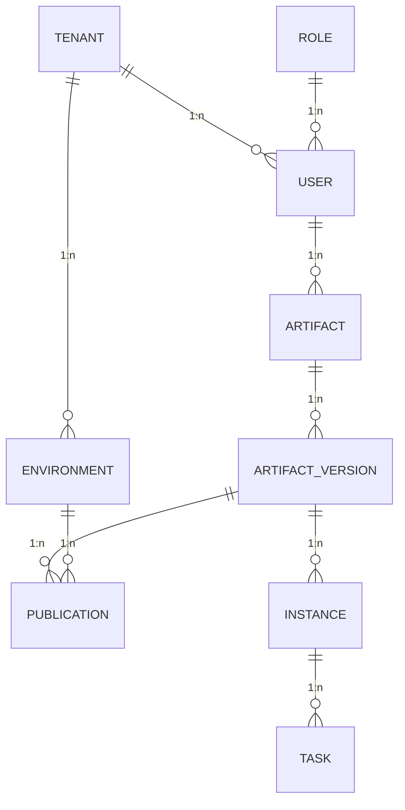

## Obiettivo della fase

La Fase 0 (EPIC 0 – Setup e Fondamenta) ha l'obiettivo di preparare il terreno per tutte le evoluzioni successive del progetto. In questa fase si raccolgono i requisiti, si definisce il modello dati e si allestisce l'infrastruttura minima per poter avviare lo sviluppo. Non vengono implementate funzionalità di business, ma si stabiliscono le fondamenta sulle quali costruire la piattaforma.

## Analisi dei requisiti e modellazione del dominio

1. **Raccolta dei requisiti**
   - Intervistare gli stakeholder per capire quali artefatti devono essere gestiti (processi BPMN, regole DMN, moduli di form, definizioni di request).
   - Definire i flussi di pubblicazione e promozione (bozza → revisione → approvazione → pubblicazione).
   - Raccogliere esigenze relative a multi‑tenant, RBAC, auditing e ambienti (DEV, QA, PROD).
2. **Definizione del modello dati**
   - Identificare le entità principali e le loro relazioni: Tenant, Utente, Ruolo, Artefatto, Versione di artefatto, Ambiente, Pubblicazione, Istanza, Task.
   - Stabilire i campi chiave per ogni entità (id, foreign key, metadati, timestamp).
   - Definire le enumerazioni (tipo di artefatto, stato dell'artefatto, stato dell'istanza, tipo di task).
   - Documentare il modello con un diagramma ER per una visione complessiva.

Dettaglio in [Requisiti](./02-requisiti.md) e [Modello dati](./03-modello-dati.md).

### Diagramma ER (sintetico)

## Scelta dello stack tecnologico

1. **Database relazionale**: PostgreSQL per robustezza, JSON e Row‑Level Security (RLS) multi‑tenant.
2. **Object storage**: MinIO per payload (BPMN, DMN, moduli) in self‑host; S3 in cloud.
3. **Orchestrazione**: Temporal per workflow duraturi, retry e compensazioni.
4. **Frontend**: React, shadcn/ui, editor bpmn.io, dmn.io, StillumForms.
5. **CI/CD**: Pipeline di lint, build e test; in seguito Helm e deploy.

Dettaglio in [Stack tecnologico](./04-stack-tecnologico.md).

## Preparazione dell'infrastruttura di sviluppo

1. **Cluster di sviluppo**: k3s/Kubernetes, Postgres, MinIO, Temporal (Helm o Docker Compose).
2. **Repository**: `/portal-ui`, `/registry-api`, `/publisher`, `/runtime-gateway`, `/docs`, `/charts`; ESLint, Prettier, EditorConfig.
3. **CI**: Workflow GitHub Actions per lint, build e test.
4. **Documentazione**: Modello dati e decisioni architetturali in questa documentazione.

Dettaglio in [Ambiente di sviluppo](./05-ambiente-di-sviluppo.md) e [Stato EPIC 0](./00-stato-epic-0.md).

## Deliverable della Fase 0

1. **Documento dei requisiti** — funzionalità richieste, stakeholder, priorità → [02-requisiti.md](./02-requisiti.md).
2. **Modello dati** — diagramma ER e descrizione entità → [03-modello-dati.md](./03-modello-dati.md).
3. **Scelta delle tecnologie** — motivazioni e linee guida → [04-stack-tecnologico.md](./04-stack-tecnologico.md).
4. **Ambiente di sviluppo** — servizi base (Postgres, MinIO, Temporal) e accessi → [05-ambiente-di-sviluppo.md](./05-ambiente-di-sviluppo.md).
5. **Struttura del repository e pipeline CI** — pronte per le fasi successive.

Questi deliverable costituiscono le fondamenta operative su cui costruire la piattaforma Stillum Business Portal e procedere con l'MVP backend (Fase 1) e i componenti frontend (Fase 2).
