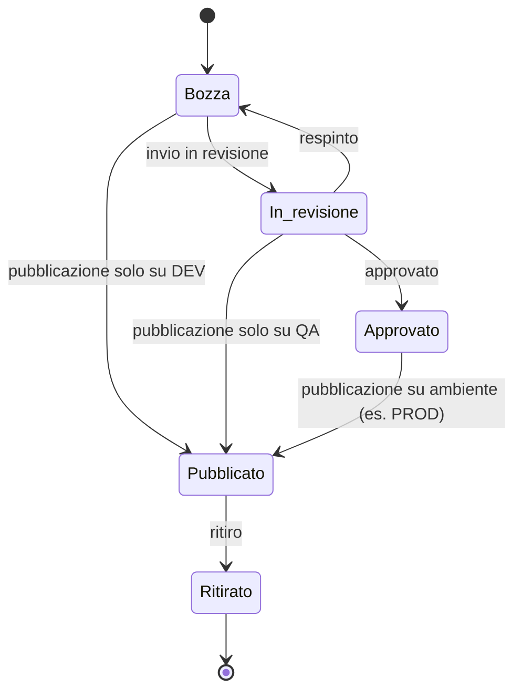

## Scopo del documento

Questo documento definisce i requisiti iniziali della piattaforma **Stillum Business Portal** come emersi dalla Fase 0 (EPIC 0). È il risultato di un processo di raccolta e risposta fra il ruolo di **architetto** (che formula le domande) e il **product owner/stakeholder** (che fornisce le risposte). I requisiti individuano cosa deve essere realizzato senza entrare nei dettagli implementativi.

## Raccolta requisiti (Q&A)

### Artefatti da gestire

**Architetto:** Quali tipi di artefatti devono essere gestiti dal portale?

**Product Owner:** Il sistema dovrà gestire quattro categorie di artefatti:

- **Processi** (definiti in BPMN) che orchestrano le attività.
- **Regole decisionali** (definite in DMN) usate per prendere decisioni all'interno dei processi.
- **Moduli** (definiti tramite StillumForms) che rappresentano le interfacce utente e la raccolta dati.
- **Requests** (contratti di servizio) che descrivono le API o operazioni invocabili dai processi.

### Gestione multi‑tenant

**Architetto:** Il sistema dovrà supportare più tenant? In che modo vanno isolati?

**Product Owner:** Sì, la piattaforma deve essere multi‑tenant nativa. Ogni tenant vedrà esclusivamente i propri artefatti, ambienti e istanze. L'isolamento sarà garantito a livello di database (tenantId su tutte le entità) e tramite politiche di Row‑Level Security. Gli amministratori di un tenant potranno gestire utenti, ruoli e ambienti del proprio dominio.

### Ciclo di vita degli artefatti

**Architetto:** Quali stati di lifecycle devono essere previsti per gli artefatti?

**Product Owner:** Ogni artefatto deve poter transitare attraverso i seguenti stati:

1. **Bozza**: definizione iniziale modificabile.
2. **In revisione**: la bozza è sottoposta a uno o più reviewer per approvazione.
3. **Approvato**: la revisione è conclusa, l'artefatto è pronto per la pubblicazione formale (in particolare su PROD).
4. **Pubblicato**: versione rilasciata in un ambiente; una stessa versione può essere pubblicata in più ambienti (es. prima QA, poi PROD).
5. **Ritirato**: l'artefatto non è più attivo in un ambiente, ma resta consultabile per audit.

Un artefatto può essere **pubblicato in un ambiente anche senza essere approvato**, con regole per ambiente: dalla **bozza** è consentita solo la pubblicazione su **DEV** (sviluppo e test); da **In revisione** è consentita la pubblicazione su **QA** (test pre-approvazione); la pubblicazione su **PROD** è riservata alle sole versioni **Approvate**, secondo policy configurabili per tenant/ambiente.

Diagramma stati (pubblicazione e promozione):

### Ambienti e promozioni

**Architetto:** Come devono essere gestiti gli ambienti (DEV/QA/PROD)?

**Product Owner:** Ogni tenant avrà uno o più ambienti (tipicamente DEV, QA, PROD). Una pubblicazione dovrà specificare in quale ambiente avviene. Dalla **bozza** è consentita la pubblicazione **solo su DEV** (sviluppo e test). Da **In revisione** è consentita la pubblicazione **solo su QA** (test pre-approvazione). Su **PROD** si potrà richiedere che la versione sia in stato *Approvato*, con policy configurabili per tenant. Devono esistere meccanismi di promozione controllata (ad esempio da DEV a QA a PROD) con eventuali approvazioni. I tenant devono poter definire ambienti aggiuntivi se necessario.

### Ruoli e permessi

**Architetto:** Quali ruoli utente sono previsti e che permessi avranno?

**Product Owner:** In fase iniziale prevediamo:

- **Analyst**: può creare e modificare bozza di artefatti.
- **Process Owner**: può rivedere e approvare bozza, pubblicare e ritirare artefatti.
- **Viewer**: può consultare artefatti pubblicati e istanze ma non modificarli.
- **Developer**: può accedere al codice e agli strumenti di integrazione.
- **Admin**: può gestire tenant, utenti, ruoli e ambienti.

L'accesso sarà controllato a livello di azione e potrà essere esteso con ACL su singoli artefatti.

### Audit e conformità

**Architetto:** È necessario tracciare le operazioni per audit?

**Product Owner:** Sì, deve essere presente un audit log che registri tutte le operazioni importanti: creazione/modifica/approvazione/pubblicazione di artefatti, promozioni di ambienti, avvii di istanze, cambio di permessi, ecc. Il log dovrà essere consultabile per tenant e filtrabile.

### Non‑functional requirements

Il sistema dovrà essere:

- **Scalabile**: capace di servire più tenant e aumentare le risorse quando il carico cresce.
- **Sicuro**: prevedere crittografia dei dati a riposo e in transito; politiche di password e autenticazione robusta; gestione sicura delle credenziali per i servizi esterni.
- **Performante**: tempi di risposta entro limiti accettabili per un portale enterprise.
- **Disponibile**: supportare ridondanza e failover dei componenti chiave (DB, storage, Temporal).
- **Portabile**: installabile sia on‑premise (k3s/Kubernetes) sia in cloud pubblico.

## Sintesi dei requisiti chiave

- Gestione di processi BPMN, regole DMN, moduli e request con versioning e ciclo di vita formalizzato.
- Supporto multi‑tenant con isolamento dati e ambienti configurabili (DEV/QA/PROD).
- Sistema di ruoli e permessi con RBAC e ACL su artefatti.
- Integrazione con Temporal per l'esecuzione dei processi.
- Audit log e conformità a requisiti di tracciabilità.
- Requisiti non funzionali di sicurezza, scalabilità, performance e disponibilità.

Questa raccolta requisiti serve come base per la progettazione del [modello dati](epic0-modello-dati), delle API e dell'infrastruttura nelle fasi successive.

---

## Allineamento con il worktree corrente

Nel worktree attuale una parte di questi requisiti è già stata implementata (vedi EPIC 1 per il dettaglio operativo):

- **Multi‑tenant + RLS**: implementato a livello DB con `app.current_tenant` e policy RLS.
- **Artefatti/versioni/dipendenze/search/storage**: implementati lato backend (Registry API) con test end‑to‑end.
- **Pubblicazione su ambienti**: implementata lato backend (Publisher) con bundle immutabili e audit.
- **RBAC/ACL**: i ruoli sono presenti come concetto/modello dati, ma l’enforcement autorizzativo fine‑grained sulle API non è completato in questo worktree.
- **Temporal**: presente nell’ambiente di sviluppo (docker‑compose), ma l’integrazione applicativa per esecuzione processi non è ancora implementata.
