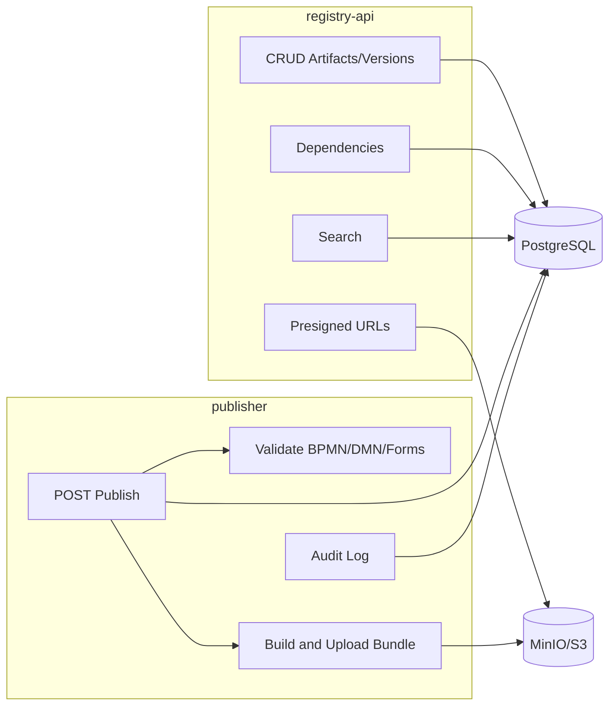

## Obiettivo della fase

La Fase 1 (EPIC 1 – MVP Backend) realizza il **backend minimo** necessario a supportare la gestione degli artefatti (processi BPMN, regole DMN, form e request) e la loro pubblicazione su ambienti configurabili (es. DEV/QA/PROD) in modo multi-tenant.

L’EPIC 1 abilita:

1. **Registry API**: gestione metadati, versioni e dipendenze; ricerca; integrazione con storage per payload tramite presigned URL.
2. **Publisher**: validazione e pubblicazione, creazione bundle immutabili e audit (tracciabilità).
3. **Database**: schema multi-tenant con migrazioni Flyway e RLS (Row-Level Security).
4. **Storage**: MinIO/S3 per payload e bundle.

Restano esplicitamente fuori scope:

- UI del portale (EPIC 2).
- Workflow di approvazione completo (EPIC 3).
- Runtime/orchestrazione Temporal (EPIC 4).
- RBAC/ACL completo e IAM (EPIC 5), oltre al tenantId passato in path.

---

## Componenti coinvolti

### Registry API

Servizio REST per:

- CRUD artefatti e versioni.
- Gestione dipendenze tra versioni.
- Ricerca (discovery).
- Presigned URL upload/download payload.
- Registrazione `payloadRef` per le versioni.
- Gestione ambienti (`environments`) per tenant.

### Publisher

Servizio REST per:

- `POST /api/tenants/{tenantId}/publish` per pubblicare una versione su un ambiente.
- Validazioni (BPMN/DMN/Forms/Request).
- Risoluzione dipendenze (tutte devono essere pubblicate).
- Generazione bundle zip con manifest + hash e upload su MinIO/S3.
- Persistenza `Publication` e scrittura `AuditLog` (successo/fallimento).

### Vista d'insieme dei flussi (EPIC 1)

---

## Deliverable della Fase 1

1. **Schema DB e migrazioni** (Flyway):
   - Tabelle core: tenant, utenti/ruoli, artefatti, versioni, ambienti, pubblicazioni, dipendenze, audit.
   - Indici (FK, tags, full-text).
   - Row-Level Security (RLS) basata su tenant.
2. **Registry API operativa**:
   - Endpoint CRUD artefatti/versioni e vincoli di immutabilità per versioni pubblicate.
   - Endpoint dipendenze + rilevamento cicli.
   - Endpoint search + filtri e paginazione.
   - Presigned URL payload e meccanismo per registrare `payloadRef`.
3. **Publisher operativo**:
   - Flusso publish completo con validazione, bundle, storage, publication e audit.
4. **Test e CI**:
   - Test unitari e di integrazione per Registry e Publisher.
   - Pipeline CI che esegue lint/build/test e verifica applicabilità migrazioni DB.

---

## Stato rispetto ai deliverable

Per una fotografia aggiornata dell’implementazione in questo worktree vedi [Stato EPIC 1](epic1-stato).

Per la documentazione di fase (overview e descrizione per moduli) vedi anche:

- `documents/docs/phase1-overview.md`
- `documents/docs/phase1-registry-api.md`
- `documents/docs/phase1-storage.md`
- `documents/docs/phase1-publisher.md`
