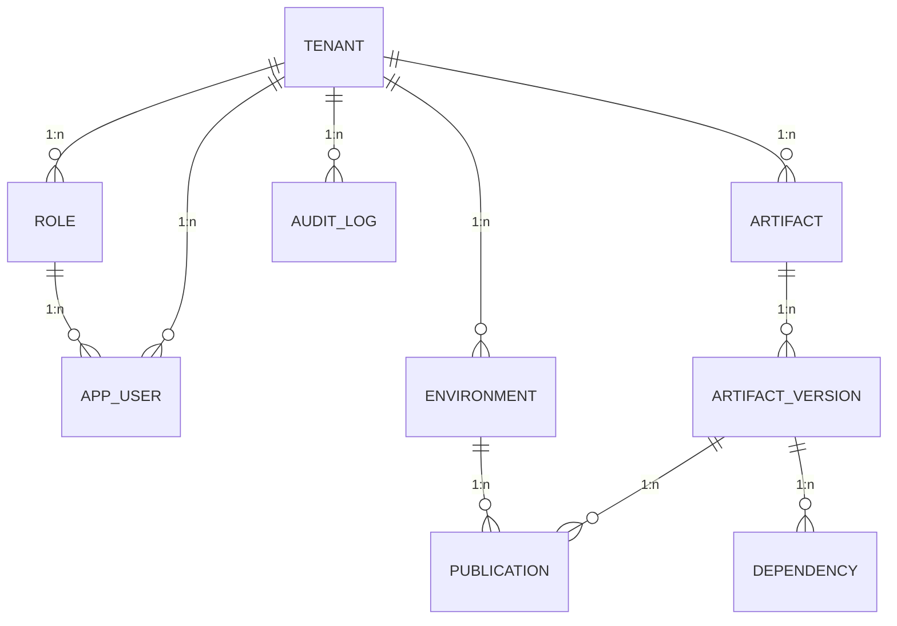

## Introduzione

Questo documento descrive il modello dati effettivo usato dalla Fase 1 (EPIC 1 – MVP Backend) nel worktree corrente, con l’obiettivo di supportare:

- multi-tenancy con `tenant_id`,
- gestione artefatti e versioni,
- dipendenze tra versioni,
- ambienti e pubblicazioni,
- audit log per la tracciabilità.

Il modello è implementato tramite migrazioni Flyway in `registry-api/src/main/resources/db/migration/`.

---

## Entità/tabelle principali (EPIC 1)

### tenant

Tenant (organizzazione/cliente).

- `id` (uuid)
- `name` (text)
- `domain` (text)
- `created_at` (timestamptz)

### role

Ruolo RBAC per tenant.

- `id` (uuid)
- `tenant_id` (uuid)
- `name` (text)
- `description` (text)

### app_user

Utente del tenant.

- `id` (uuid)
- `tenant_id` (uuid)
- `role_id` (uuid)
- `name` (text)
- `email` (text)
- `created_at`, `updated_at` (timestamptz)

### artifact

Metadati dell’artefatto (process/rule/form/request).

- `id` (uuid)
- `tenant_id` (uuid)
- `type` (enum)
- `title` (text)
- `description` (text)
- `area` (text)
- `tags` (text[])
- `status` (enum)
- `owner_id` (uuid, opzionale)
- `created_at`, `updated_at` (timestamptz)

### artifact_version

Versione concreta di un artefatto; punta al payload su storage via `payload_ref`.

- `id` (uuid)
- `artifact_id` (uuid)
- `version` (text)
- `state` (enum)
- `payload_ref` (text, opzionale)
- `metadata` (jsonb, opzionale)
- `created_by` (uuid, opzionale)
- `created_at` (timestamptz)

### environment

Ambiente (DEV/QA/PROD) per tenant.

- `id` (uuid)
- `tenant_id` (uuid)
- `name` (text)
- `description` (text)

### publication

Pubblicazione di una versione in un ambiente.

- `id` (uuid)
- `artifact_version_id` (uuid)
- `environment_id` (uuid)
- `published_by` (uuid, opzionale)
- `published_at` (timestamptz)
- `notes` (text, opzionale)
- `bundle_ref` (text, opzionale)

### dependency

Dipendenza fra versioni (grafo).

- `id` (uuid)
- `artifact_version_id` (uuid)
- `depends_on_artifact_id` (uuid, opzionale)
- `depends_on_version_id` (uuid, opzionale)

### audit_log

Log di audit per tenant.

- `id` (uuid)
- `tenant_id` (uuid)
- `entity_type` (text)
- `entity_id` (uuid, opzionale)
- `action` (text)
- `actor_id` (uuid, opzionale)
- `timestamp` (timestamptz)
- `details` (jsonb, opzionale)

---

## Relazioni e schema ER (EPIC 1)

---

## Indici e ricerca

Il modello prevede indici per:

- lookup per tenant, tipo, stato, area;
- tags tramite indice GIN su array;
- ricerca full-text su `title` e `description` tramite indice GIN su `to_tsvector(...)`.

Implementazione: `V3__create_indexes.sql`.

---

## Row-Level Security (RLS)

Le tabelle multi-tenant hanno RLS abilitata e policy basate su:

`tenant_id = current_setting('app.current_tenant', true)::UUID`

Per tabelle che non hanno `tenant_id` diretto (es. `artifact_version`, `publication`, `dependency`) la policy risale al tenant tramite join/IN su `artifact`.

Implementazione: `V4__create_rls_policies.sql`.

Nota operativa: l’RLS richiede che il servizio imposti `app.current_tenant` per request/transazione (es. via `set_config('app.current_tenant', ..., true)`).
