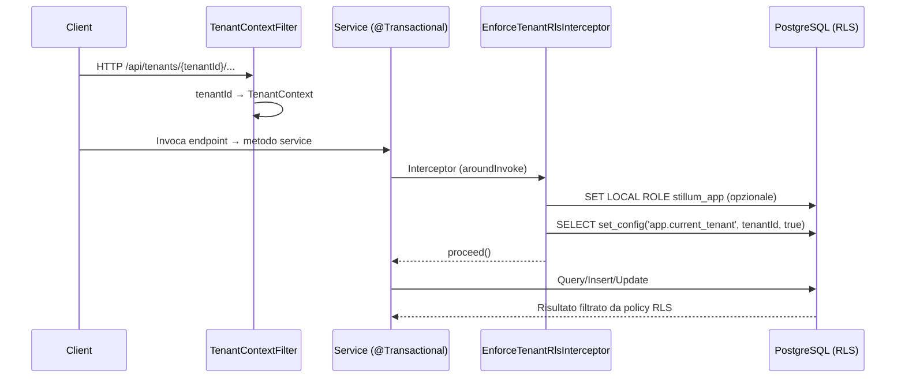

## Scopo

Questa pagina riassume come la Fase 1 (EPIC 1) è implementata evidenziando:

- endpoint principali già presenti,
- configurazione DB e storage,
- punti di integrazione ancora necessari per chiudere l’EPIC.

Per lo stato complessivo vedi [Stato EPIC 1](epic1-stato).

---

## Registry API

### Base path

Le risorse sono montate sotto:

- `/api/...` (configurato in `RegistryApiApplication`)

### Endpoint principali (implementati)

- Artefatti:
  - `POST /api/tenants/{tenantId}/artifacts`
  - `GET /api/tenants/{tenantId}/artifacts`
  - `GET /api/tenants/{tenantId}/artifacts/{artifactId}`
  - `PUT /api/tenants/{tenantId}/artifacts/{artifactId}`
  - `DELETE /api/tenants/{tenantId}/artifacts/{artifactId}`
- Versioni:
  - `POST /api/tenants/{tenantId}/artifacts/{artifactId}/versions`
  - `GET /api/tenants/{tenantId}/artifacts/{artifactId}/versions`
  - `GET /api/tenants/{tenantId}/artifacts/{artifactId}/versions/{versionId}`
  - `PUT /api/tenants/{tenantId}/artifacts/{artifactId}/versions/{versionId}`
  - `DELETE /api/tenants/{tenantId}/artifacts/{artifactId}/versions/{versionId}`
  - `PUT /api/tenants/{tenantId}/artifacts/{artifactId}/versions/{versionId}/payload-ref`
- Dipendenze:
  - `POST /api/tenants/{tenantId}/artifacts/{artifactId}/versions/{versionId}/dependencies`
  - `GET /api/tenants/{tenantId}/artifacts/{artifactId}/versions/{versionId}/dependencies`
  - `DELETE /api/tenants/{tenantId}/artifacts/{artifactId}/versions/{versionId}/dependencies/{dependencyId}`
- Search:
  - `GET /api/tenants/{tenantId}/search/artifacts`
- Storage payload:
  - `GET /api/tenants/{tenantId}/storage/upload-url`
  - `GET /api/tenants/{tenantId}/storage/download-url`

---

## Database

### Flyway

- Flyway è configurato per eseguire migrazioni all’avvio del servizio.
- Le migrazioni risiedono in: `registry-api/src/main/resources/db/migration/`.

### RLS e tenant context

Sono presenti componenti complementari per rendere l’isolamento multi-tenant enforced a livello DB:

- `TenantContextFilter`: estrae `tenantId` dalla path e lo mette in `TenantContext`.
- `EnforceTenantRlsInterceptor` + `@EnforceTenantRls`: assicurano che, all’inizio di ogni transazione applicativa, venga invocata la propagazione del tenant verso PostgreSQL.
- `RlsSessionInitializer`: imposta `app.current_tenant` usando `set_config(..., true)` (valido solo per la transazione corrente). Opzionalmente può eseguire `SET LOCAL ROLE <role>` se configurato.

Perché l’RLS sia effettivamente “enforced”, il `tenantId` deve essere impostato *dentro* la stessa transazione che esegue query/insert/update su tabelle con RLS.

#### Configurazione (opzionale)

- `stillum.rls.assume-role`: se valorizzata, il servizio esegue `SET LOCAL ROLE <role>` ad ogni transazione prima del `set_config`. Questo è utile soprattutto in test/DevServices, dove l’utente DB può essere superuser e quindi bypassare RLS.

#### Test (DB-level)

- È presente un test che verifica che la visibilità su `artifact` dipenda da `app.current_tenant` (e non solo dai filtri applicativi) e che RLS sia applicata tramite `SET LOCAL ROLE stillum_app`.

---

## Storage (MinIO / S3)

### Configurazione

La Registry API usa AWS SDK via Quarkus S3 con parametri esternalizzati (endpoint, credenziali, bucket, expiry).

Esempi di proprietà:

- `stillum.storage.artifacts-bucket`
- `stillum.storage.bundles-bucket`
- `stillum.storage.presigned-url-expiry-seconds`

### Convenzioni path oggetti

Il builder definisce percorsi coerenti con multi-tenancy:

- Payload: `tenant-{tenantId}/artifacts/{type}/{artifactId}/{versionId}.{ext}`
- Bundle: `tenant-{tenantId}/bundles/{type}/{artifactId}/{versionId}.zip`

---

## Publisher

Nel worktree il servizio `publisher/` è presente come base Quarkus ma non implementa ancora EPIC 1 oltre all’health check. Il completamento di EPIC 1 richiede:

- endpoint publish + validazioni,
- creazione bundle + upload su bucket bundles,
- persist `publication` + update stato versione,
- scrittura `audit_log`.

---

## CI e sviluppo locale

- CI: workflow principale in `.github/workflows/ci.yml`.
- Stack locale: `docker-compose.yml` include PostgreSQL, MinIO e Temporal.

### Sequenza (request → DB) per enforcement RLS

