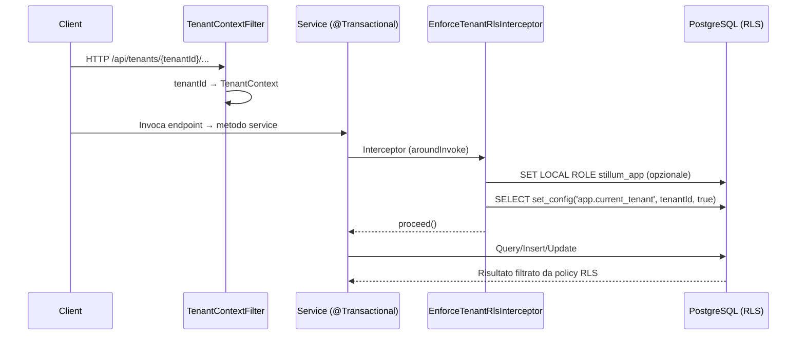

## Scopo

Questa pagina riassume come la Fase 1 (EPIC 1) è implementata evidenziando:

- endpoint principali già presenti,
- configurazione DB e storage,
- punti di integrazione ancora necessari per chiudere l’EPIC.

Per lo stato complessivo vedi [Stato EPIC 1](epic1-stato).

---

## Registry API

### Base path

Le risorse sono montate sotto:

- `/api/...` (configurato in `RegistryApiApplication`)

### Endpoint principali (implementati)

- Artefatti:
  - `POST /api/tenants/{tenantId}/artifacts`
  - `GET /api/tenants/{tenantId}/artifacts`
  - `GET /api/tenants/{tenantId}/artifacts/{artifactId}`
  - `PUT /api/tenants/{tenantId}/artifacts/{artifactId}`
  - `DELETE /api/tenants/{tenantId}/artifacts/{artifactId}`
- Versioni:
  - `POST /api/tenants/{tenantId}/artifacts/{artifactId}/versions`
  - `GET /api/tenants/{tenantId}/artifacts/{artifactId}/versions`
  - `GET /api/tenants/{tenantId}/artifacts/{artifactId}/versions/{versionId}`
  - `PUT /api/tenants/{tenantId}/artifacts/{artifactId}/versions/{versionId}`
  - `DELETE /api/tenants/{tenantId}/artifacts/{artifactId}/versions/{versionId}`
  - `PUT /api/tenants/{tenantId}/artifacts/{artifactId}/versions/{versionId}/payload-ref`
- Dipendenze:
  - `POST /api/tenants/{tenantId}/artifacts/{artifactId}/versions/{versionId}/dependencies`
  - `GET /api/tenants/{tenantId}/artifacts/{artifactId}/versions/{versionId}/dependencies`
  - `DELETE /api/tenants/{tenantId}/artifacts/{artifactId}/versions/{versionId}/dependencies/{dependencyId}`
- Search:
  - `GET /api/tenants/{tenantId}/search/artifacts`
- Environments:
  - `POST /api/tenants/{tenantId}/environments`
  - `GET /api/tenants/{tenantId}/environments`
  - `GET /api/tenants/{tenantId}/environments/{environmentId}`
  - `PUT /api/tenants/{tenantId}/environments/{environmentId}`
  - `DELETE /api/tenants/{tenantId}/environments/{environmentId}`
- Storage payload:
  - `GET /api/tenants/{tenantId}/storage/upload-url`
  - `GET /api/tenants/{tenantId}/storage/download-url`
- Storage bundle:
  - `GET /api/tenants/{tenantId}/storage/bundle-upload-url`
  - `GET /api/tenants/{tenantId}/storage/bundle-download-url`

### Search (Postgres FTS baseline)

La ricerca implementata usa Postgres full‑text search su titolo/descrizione e supporta filtri (type/status/area/tag) e paginazione.

La copertura è verificata con test end‑to‑end dedicati sulla risorsa search.

---

## Database

### Flyway

- Flyway è configurato per eseguire migrazioni all’avvio del servizio.
- Le migrazioni risiedono in: `registry-api/src/main/resources/db/migration/`.

### RLS e tenant context

Sono presenti componenti complementari per rendere l’isolamento multi-tenant enforced a livello DB:

- `TenantContextFilter`: estrae `tenantId` dalla path e lo mette in `TenantContext`.
- `EnforceTenantRlsInterceptor` + `@EnforceTenantRls`: assicurano che, all’inizio di ogni transazione applicativa, venga invocata la propagazione del tenant verso PostgreSQL.
- `RlsSessionInitializer`: imposta `app.current_tenant` usando `set_config(..., true)` (valido solo per la transazione corrente). Opzionalmente può eseguire `SET LOCAL ROLE <role>` se configurato.

Perché l’RLS sia effettivamente “enforced”, il `tenantId` deve essere impostato *dentro* la stessa transazione che esegue query/insert/update su tabelle con RLS.

#### Configurazione (opzionale)

- `stillum.rls.assume-role`: se valorizzata, il servizio esegue `SET LOCAL ROLE <role>` ad ogni transazione prima del `set_config`. Questo è utile soprattutto in ambienti dove l’utente DB potrebbe bypassare RLS (es. utente con privilegi elevati).

#### Test (DB-level)

- È presente un test che verifica che la visibilità su `artifact` dipenda da `app.current_tenant` (e non solo dai filtri applicativi) e che RLS sia applicata tramite `SET LOCAL ROLE stillum_app`.
- Lo stesso approccio (filter + interceptor + `set_config`) è applicato anche in `publisher`.

---

## Storage (MinIO / S3)

### Configurazione

La Registry API usa AWS SDK via Quarkus S3 con parametri esternalizzati (endpoint, credenziali, bucket, expiry).

Nel profilo `test`, i bucket vengono creati automaticamente all’avvio per evitare errori `NoSuchBucket` nelle suite di integrazione storage. I test usano un endpoint S3 compatibile (MinIO) esterno e non DevServices/LocalStack.

Esempi di proprietà:

- `stillum.storage.artifacts-bucket`
- `stillum.storage.bundles-bucket`
- `stillum.storage.presigned-url-expiry-seconds`

### Convenzioni path oggetti

Il builder definisce percorsi coerenti con multi-tenancy:

- Payload: `tenant-{tenantId}/artifacts/{type}/{artifactId}/{versionId}.{ext}`
- Bundle: `tenant-{tenantId}/bundles/{type}/{artifactId}/{versionId}.zip`

### Bundle (presigned + no-overwrite)

- Upload bundle: `GET /api/tenants/{tenantId}/storage/bundle-upload-url`
  - restituisce presigned URL + `key`
  - rifiuta la generazione se l’oggetto esiste già (no-overwrite, `409`)
- Download bundle: `GET /api/tenants/{tenantId}/storage/bundle-download-url`
  - restituisce presigned URL + `key`
  - ritorna `404` se l’oggetto non esiste

---

## Publisher

Il servizio `publisher/` implementa il flusso MVP di pubblicazione e gestisce la transizione di una versione da `DRAFT` a `PUBLISHED`, creando un bundle immutabile su S3 e registrando `Publication` + `AuditLog`.

### Endpoint principali

- `POST /api/tenants/{tenantId}/publish`
- `GET /api/tenants/{tenantId}/publish/{publicationId}`

### Flusso MVP

1. Verifica `Environment` per tenant
2. Lettura `Artifact` + `ArtifactVersion` e verifica `state != PUBLISHED`
   - guard-rail: se `Environment.name == PROD` allora `ArtifactVersion.state` deve essere `APPROVED`
3. Download payload da S3 usando `payloadRef` (bucket artifacts) e validazione base
4. Verifica dipendenze: tutte le versioni dipendenti devono essere `PUBLISHED`
5. Creazione bundle zip con:
   - `manifest.json` (metadati + SHA-256 file)
   - payload root + payload dipendenze
6. Upload bundle su bucket bundles con path `tenant-{tenantId}/bundles/{type}/{artifactId}/{versionId}.zip`
7. Persistenza `publication` + update `artifact_version.state = PUBLISHED`
8. Scrittura audit su transazione separata:
   - `PUBLISH_SUCCESS` o `PUBLISH_FAILURE`

### Validazioni payload

- Stato attuale (MVP): validazione sintattica (XML well-formed con hardening XXE, JSON parse).
- Prossimo step: integrare/riusare le validazioni già implementate nel progetto Editors (non ancora incluso in questo repo) per ottenere:
  - validazioni BPMN/DMN più specifiche,
  - JSON Schema per form/request,
  - messaggi errore coerenti con l’esperienza editor.

---

## CI e sviluppo locale

- CI: workflow principale in `.github/workflows/ci.yml`.
- Stack locale: `docker-compose.yml` include PostgreSQL, MinIO e Temporal.
- In CI e in locale, i test backend assumono la disponibilità di PostgreSQL e MinIO (avviabili con `docker compose up -d postgres minio minio-init`).

### Sequenza (request → DB) per enforcement RLS

