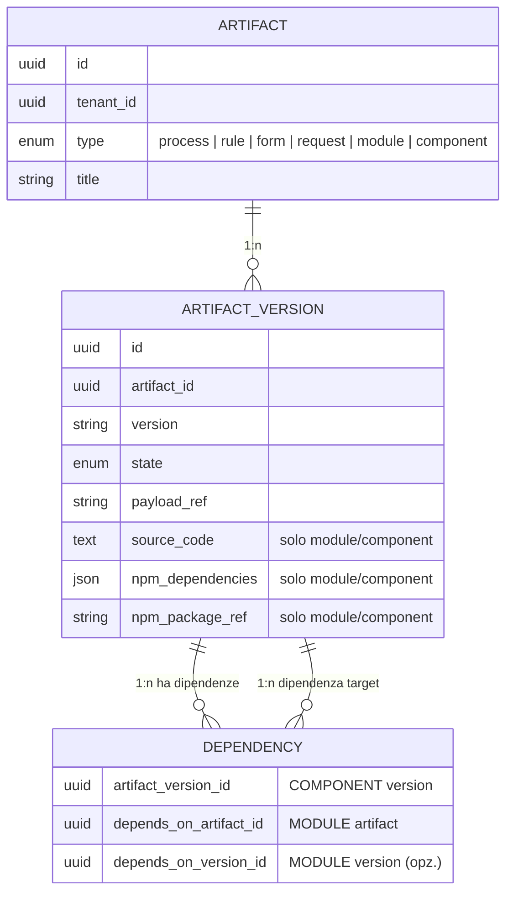

# Modello Dati – Artefatti UI React e Packaging NPM

## Modifiche al modello esistente

### Estensione dell'enum ArtifactType

```
ArtifactType: { PROCESS, RULE, FORM, REQUEST, MODULE, COMPONENT }
```

I valori `MODULE` e `COMPONENT` sono gia presenti nel codice (`ArtifactType.java`).

### Nuovi campi su ArtifactVersion

| Campo | Tipo | Obbligatorio | Descrizione |
|-------|------|:---:|-------------|
| `source_code` | text | No | Codice sorgente React/TypeScript. Pertinente solo per `MODULE` e `COMPONENT`. |
| `npm_dependencies` | json | No | Mappa `{ "nome-lib": "^versione" }` delle dipendenze npm. Pertinente solo per `MODULE` e `COMPONENT`. |
| `npm_package_ref` | string | No | Puntatore al pacchetto npm generato dalla build (es. `@stillum/tenant-abc/my-module@1.0.0`). Valorizzato dopo la pubblicazione. |

### Relazione Modulo → Componenti (tabella dependency)

La tabella `dependency` esistente viene riutilizzata per rappresentare la relazione Modulo→Componenti:

```
dependency
├── artifact_version_id   → ArtifactVersion (il COMPONENT)
├── depends_on_artifact_id → Artifact (il MODULE padre)
└── depends_on_version_id  → ArtifactVersion (la versione del MODULE padre, opzionale)
```

Un `COMPONENT` dichiara una dipendenza verso il `MODULE` padre. Il Registry risolve il grafo per restituire l'elenco completo dei componenti di un modulo.

## Diagramma ER (estensione)



## Migrazione DB prevista

```sql
-- V10.1__add_module_component_fields.sql
ALTER TABLE artifact_version
    ADD COLUMN source_code TEXT,
    ADD COLUMN npm_dependencies JSONB,
    ADD COLUMN npm_package_ref VARCHAR(500);

COMMENT ON COLUMN artifact_version.source_code IS 'Codice sorgente React/TypeScript per artefatti MODULE e COMPONENT';
COMMENT ON COLUMN artifact_version.npm_dependencies IS 'Mappa JSON delle dipendenze npm (nome→versione) per artefatti MODULE e COMPONENT';
COMMENT ON COLUMN artifact_version.npm_package_ref IS 'Riferimento al pacchetto npm generato dalla build per artefatti MODULE e COMPONENT';
```
