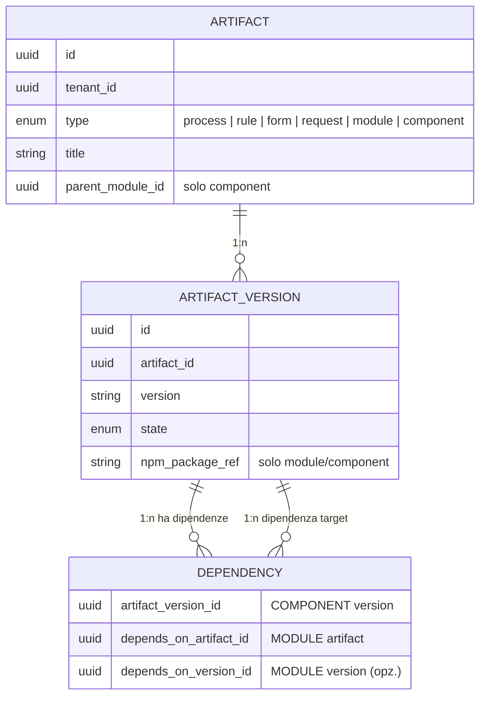

# Modello Dati – Artefatti UI React e Packaging NPM

## Modifiche al modello esistente

### Estensione dell'enum ArtifactType

```
ArtifactType: { PROCESS, RULE, FORM, REQUEST, MODULE, COMPONENT }
```

I valori `MODULE` e `COMPONENT` sono gia presenti nel codice (`ArtifactType.java`).

### Nuovi campi su ArtifactVersion

Nel worktree corrente non viene salvato il sorgente React nel database. I file di una versione (payload e sorgenti) sono persistiti su MinIO/S3 con chiavi convenzionali e resi disponibili dall’API come mappa `files` (path → contenuto).

L’unico campo “nuovo” che rimane su `artifact_version` per EPIC 10 è:

| Campo | Tipo | Obbligatorio | Descrizione |
|-------|------|:---:|-------------|
| `npm_package_ref` | string | No | Puntatore al pacchetto npm generato dalla build (es. `@stillum/<scope>/<pkg>@<version>` o URL/path su Nexus). Valorizzato dopo la pubblicazione. |

### Relazione Modulo → Componenti

Nel worktree corrente la relazione strutturale Modulo→Componenti è rappresentata su `artifact.parent_module_id`:

- Un `COMPONENT` ha `parent_module_id` valorizzato al `MODULE` padre.
- Il Registry usa questa relazione per comporre il workspace editor (modulo + componenti).

La tabella `dependency` resta disponibile per modellare dipendenze tra versioni (es. un `MODULE` che usa `COMPONENT` specifici da includere nella build/publish).

## Diagramma ER (estensione)


```mermaid
erDiagram
    ARTIFACT ||--o{ ARTIFACT_VERSION : "1:n"
    ARTIFACT {
        uuid id
        uuid tenant_id
        enum type "process | rule | form | request | module | component"
        string title
        uuid parent_module_id "solo component"
    }

    ARTIFACT_VERSION ||--o{ DEPENDENCY : "1:n ha dipendenze"
    ARTIFACT_VERSION {
        uuid id
        uuid artifact_id
        string version
        enum state
        string npm_package_ref "solo module/component"
    }

    DEPENDENCY {
        uuid artifact_version_id "COMPONENT version"
        uuid depends_on_artifact_id "MODULE artifact"
        uuid depends_on_version_id "MODULE version (opz.)"
    }

    ARTIFACT_VERSION ||--o{ DEPENDENCY : "1:n dipendenza target"
```

## Migrazione DB implementata

```sql
-- V8__add_module_component_types.sql
-- Aggiunta MODULE/COMPONENT all'enum/check dei tipi artifact

-- V11__add_parent_module_id.sql
-- Aggiunta parent_module_id su artifact per legare COMPONENT → MODULE

-- V17__unify_source_ref.sql + V19__drop_source_ref.sql
-- Rimozione campi legacy (payload_ref/source_ref/source_code/...) in favore di file su S3 con chiavi convenzionali
```

Nel worktree sono presenti migrazioni “intermedie” (es. V10/V12/V13) introdotte durante l’evoluzione di EPIC 10 e poi superate: lo stato finale è la persistenza dei file su storage e l’uso di `npm_package_ref` su `artifact_version`.

## API implementate

### Endpoint MODULE
- `POST /api/tenants/{tenantId}/artifacts/modules` - Crea un nuovo artefatto MODULE
  - Request body: `CreateModuleRequest(title, description, area, tags)`
  - Response: `ArtifactResponse` con type = MODULE
  - Crea automaticamente una versione iniziale "0.1.0"

### Endpoint COMPONENT
- `POST /api/tenants/{tenantId}/artifacts/components` - Crea un nuovo artefatto COMPONENT
  - Request body: `CreateComponentRequest(title, description, area, tags, parentModuleId)`
  - Response: `ArtifactResponse` con type = COMPONENT
  - Validazione: `parentModuleId` deve puntare a un MODULE esistente nello stesso tenant
  - Crea automaticamente una versione iniziale "0.1.0"

### Validazione COMPONENT→MODULE
La validazione è implementata in `ArtifactService.createComponent()`:
- Verifica che il `parentModuleId` esista nel tenant
- Verifica che l'artefatto padre sia di tipo MODULE
- Lancia `IllegalArgumentException` se le condizioni non sono soddisfatte
