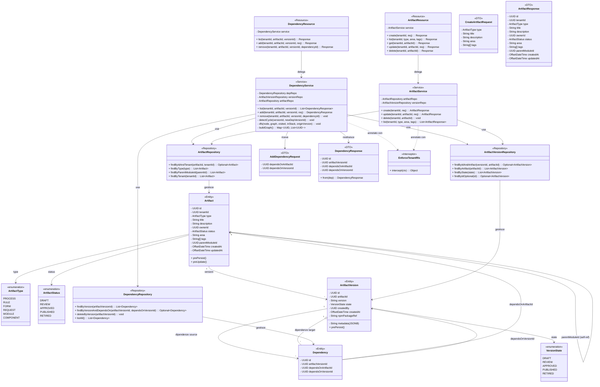
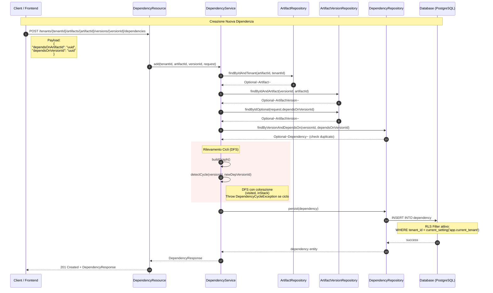

# Sistema di Persistenza delle Dipendenze - Stillum Business Central

## Class Diagram - Architettura Completa



## Sequence Diagram - Creazione Dipendenza



## ER Diagram - Schema Database Completo

```mermaid
erDiagram
    TENANT ||--o{ ARTIFACT : "ha"
    TENANT ||--o{ APP_USER : "ha"
    TENANT ||--o{ ENVIRONMENT : "ha"
    TENANT ||--o{ AUDIT_LOG : "ha"

    ROLE ||--o{ APP_USER : "assegnato a"

    APP_USER ||--o{ ARTIFACT : "crea"
    APP_USER ||--o{ ARTIFACT_VERSION : "crea"
    APP_USER ||--o{ PUBLICATION : "pubblica"

    ARTIFACT ||--o{ ARTIFACT_VERSION : "versioni"
    ARTIFACT o--|| ARTIFACT : "parent_module_id (self-ref)"

    ARTIFACT_VERSION ||--o{ DEPENDENCY : "dipendenze source"
    ARTIFACT_VERSION ||--o{ DEPENDENCY : "dipendenze target"
    ARTIFACT_VERSION ||--o{ PUBLICATION : "pubblicazioni"

    DEPENDENCY }|--|| ARTIFACT : "dipende da (artifact)"
    DEPENDENCY }|--|| ARTIFACT_VERSION : "dipende da (version)"

    ENVIRONMENT ||--o{ PUBLICATION : "pubblicazioni in"

    TENANT {
        uuid id PK
        varchar name
        varchar domain
        timestamptz created_at
    }

    APP_USER {
        uuid id PK
        uuid tenant_id FK
        uuid role_id FK
        varchar name
        varchar email
        varchar password_hash
        timestamptz created_at
        timestamptz updated_at
    }

    ROLE {
        uuid id PK
        uuid tenant_id FK
        varchar name
        text description
    }

    ARTIFACT {
        uuid id PK
        uuid tenant_id FK
        varchar type
        varchar title
        text description
        uuid owner_id FK
        varchar status
        varchar area
        text[] tags
        uuid parent_module_id FK
        timestamptz created_at
        timestamptz updated_at
    }

    ARTIFACT_VERSION {
        uuid id PK
        uuid artifact_id FK
        varchar version
        varchar state
        uuid created_by FK
        timestamptz created_at
        jsonb metadata
        varchar npm_package_ref
    }

    DEPENDENCY {
        uuid id PK
        uuid artifact_version_id FK
        uuid depends_on_artifact_id FK
        uuid depends_on_version_id FK
    }

    ENVIRONMENT {
        uuid id PK
        uuid tenant_id FK
        varchar name
        text description
    }

    PUBLICATION {
        uuid id PK
        uuid artifact_version_id FK
        uuid environment_id FK
        uuid published_by FK
        timestamptz published_at
        text notes
        varchar bundle_ref
    }

    AUDIT_LOG {
        uuid id PK
        uuid tenant_id FK
        varchar entity_type
        uuid entity_id
        varchar action
        uuid actor_id FK
        timestamptz timestamp
        jsonb details
    }
```

## Database Schema - Tabelle Dettagliate

### Tabella ARTIFACT
```sql
CREATE TABLE artifact (
    id          UUID         PRIMARY KEY DEFAULT gen_random_uuid(),
    tenant_id   UUID         NOT NULL REFERENCES tenant(id) ON DELETE CASCADE,
    type        VARCHAR(20)  NOT NULL,
    title       VARCHAR(255) NOT NULL,
    description TEXT,
    owner_id    UUID         REFERENCES app_user(id) ON DELETE SET NULL,
    status      VARCHAR(20)  NOT NULL DEFAULT 'DRAFT',
    area        VARCHAR(100),
    tags        TEXT[],
    parent_module_id UUID     REFERENCES artifact(id) ON DELETE SET NULL,
    created_at  TIMESTAMPTZ  NOT NULL DEFAULT NOW(),
    updated_at  TIMESTAMPTZ  NOT NULL DEFAULT NOW(),
    CONSTRAINT artifact_type_check CHECK (type IN ('PROCESS', 'RULE', 'FORM', 'REQUEST', 'MODULE', 'COMPONENT')),
    CONSTRAINT artifact_status_check CHECK (status IN ('DRAFT', 'REVIEW', 'APPROVED', 'PUBLISHED', 'RETIRED'))
);
```

### Tabella ARTIFACT_VERSION
```sql
CREATE TABLE artifact_version (
    id          UUID         PRIMARY KEY DEFAULT gen_random_uuid(),
    artifact_id UUID         NOT NULL REFERENCES artifact(id) ON DELETE CASCADE,
    version     VARCHAR(50)  NOT NULL,
    state       VARCHAR(20)  NOT NULL DEFAULT 'DRAFT',
    created_by  UUID         REFERENCES app_user(id) ON DELETE SET NULL,
    created_at  TIMESTAMPTZ  NOT NULL DEFAULT NOW(),
    metadata    JSONB,
    npm_package_ref VARCHAR(500),
    UNIQUE (artifact_id, version),
    CONSTRAINT version_state_check CHECK (state IN ('DRAFT', 'REVIEW', 'APPROVED', 'PUBLISHED', 'RETIRED'))
);
```

### Tabella DEPENDENCY
```sql
CREATE TABLE dependency (
    id                     UUID NOT NULL DEFAULT gen_random_uuid() PRIMARY KEY,
    artifact_version_id    UUID NOT NULL REFERENCES artifact_version(id) ON DELETE CASCADE,
    depends_on_artifact_id UUID NOT NULL REFERENCES artifact(id),
    depends_on_version_id  UUID NOT NULL REFERENCES artifact_version(id),
    UNIQUE (artifact_version_id, depends_on_version_id)
);
```

## Note e Spiegazioni

### Rilevamento Cicli
Il sistema utilizza un algoritmo DFS (Depth-First Search) con colorazione per rilevare cicli nel grafo di dipendenze:
- **visited**: nodi già visitati completamente
- **inStack**: nodi nel path corrente della ricorsione
- Se un nodo è già in `inStack`, significa che è presente un ciclo

### Row-Level Security (RLS)
PostgreSQL RLS viene applicato automaticamente tramite l'interceptor `EnforceTenantRls`:
- Filtra tutte le query per tenant
- Previene accessi cross-tenant
- Attivo per tutti i repository

### Relazione Polimorfica
La tabella `dependency` gestisce due tipi di relazioni:
1. **Dipendenze tradizionali**: PROCESS → RULE, FORM → REQUEST
2. **Dipendenze di build/publish**: un MODULE può dichiarare dipendenze verso COMPONENT/versioni da includere nel bundle e nella build npm

La relazione strutturale Modulo→Componenti (workspace editor) è invece modellata su `artifact.parent_module_id`.

### Migrazioni Flyway
- **V1__schema.sql**: schema completo (tabelle, indici, RLS) che include MODULE/COMPONENT, `parent_module_id` e `npm_package_ref`
- **V2__seed_data.sql**: seed dev/demo idempotente (tenant, ruoli, utente demo, environments)

## API Endpoints

### Dipendenze
```
GET    /api/tenants/{tenantId}/artifacts/{artifactId}/versions/{versionId}/dependencies
POST   /api/tenants/{tenantId}/artifacts/{artifactId}/versions/{versionId}/dependencies
DELETE /api/tenants/{tenantId}/artifacts/{artifactId}/versions/{versionId}/dependencies/{dependencyId}
```

### Artefatti
```
GET    /api/tenants/{tenantId}/artifacts
POST   /api/tenants/{tenantId}/artifacts
GET    /api/tenants/{tenantId}/artifacts/{artifactId}
PUT    /api/tenants/{tenantId}/artifacts/{artifactId}
DELETE /api/tenants/{tenantId}/artifacts/{artifactId}
```

---

**Sviluppato per**: Stillum Business Central  
**Analisi completa**: Sistema di persistenza delle dipendenze tra artefatti  
**Versioni rilevanti**: V1__schema, V2__seed_data
