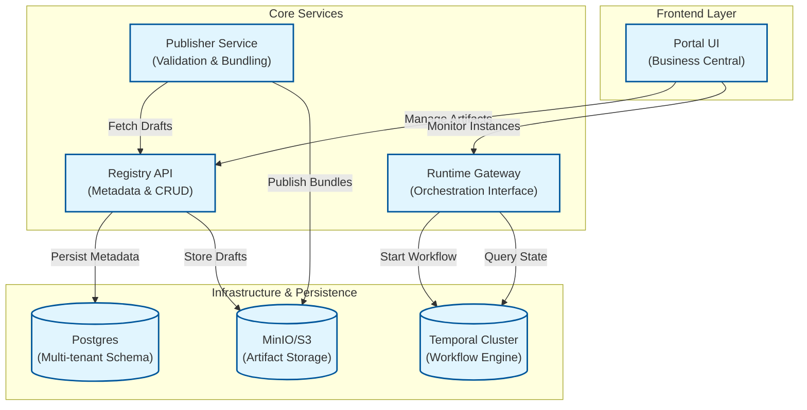

Questo diagramma illustra i principali componenti della piattaforma Stillum Business Portal e i flussi tra loro.

```mermaid
graph TD
    subgraph "Frontend Layer"
        UI["Portal UI<br>(Business Central)"]
    end

    subgraph "Core Services"
        REG["Registry API<br>(Metadata & CRUD)"]
        PUB["Publisher Service<br>(Validation & Bundling)"]
        GW["Runtime Gateway<br>(Orchestration Interface)"]
    end

    subgraph "Infrastructure & Persistence"
        DB[("Postgres<br>(Multi-tenant Schema)")]
        S3[("MinIO/S3<br>(Artifact Storage)")]
        TEMP[("Temporal Cluster<br>(Workflow Engine)")]
    end

    %% Flows
    UI -- "Manage Artifacts" --> REG
    UI -- "Monitor Instances" --> GW
    REG -- "Persist Metadata" --> DB
    REG -- "Store Drafts" --> S3
    PUB -- "Fetch Drafts" --> REG
    PUB -- "Publish Bundles" --> S3
    GW -- "Start Workflow" --> TEMP
    GW -- "Query State" --> TEMP

    classDef new fill:#e1f5fe,stroke:#01579b,stroke-width:2px;
    class UI,REG,PUB,GW,DB,S3,TEMP new;
```