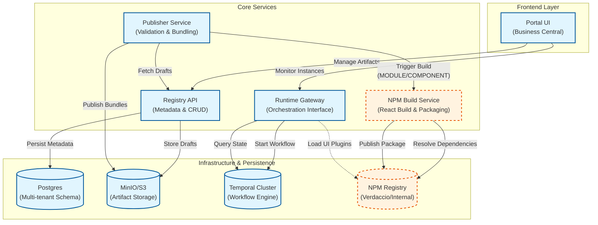

Questo diagramma illustra i principali componenti della piattaforma Stillum Business Portal e i flussi tra loro.

> **Nota:** i componenti `NPM Build Service` e `NPM Registry` (tratteggiati) fanno parte della EPIC 10 – Artefatti UI React e Packaging NPM. Il Build Service compila il codice React degli artefatti MODULE/COMPONENT, risolve le dipendenze npm e pubblica il pacchetto risultante sul registry npm interno. Il Runtime Gateway carica i pacchetti npm come plugin UI a run-time.