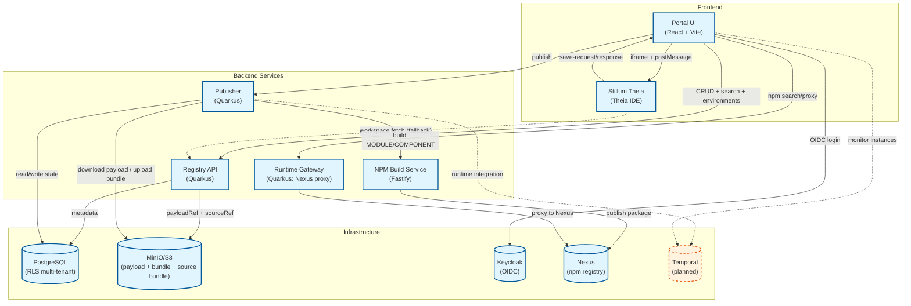

Questo diagramma illustra i principali componenti della piattaforma Stillum Business Portal e i flussi tra loro.

```mermaid
graph TD
    subgraph "Frontend"
        UI["Portal UI<br/>(React + Vite)"]
        IDE["Stillum Theia<br/>(Theia IDE)"]
    end

    subgraph "Backend Services"
        REG["Registry API<br/>(Quarkus)"]
        PUB["Publisher<br/>(Quarkus)"]
        NPM["NPM Build Service<br/>(Fastify)"]
        GW["Runtime Gateway<br/>(Quarkus: Nexus proxy)"]
    end

    subgraph "Infrastructure"
        DB[("PostgreSQL<br/>(RLS multi-tenant)")]
        S3[("MinIO/S3<br/>(payload + bundle + source bundle)")]
        KC[("Keycloak<br/>(OIDC)")]
        NX[("Nexus<br/>(npm registry)")]
        TEMP[("Temporal<br/>(planned)")]
    end

    %% Identity
    UI -- "OIDC login" --> KC

    %% Portal ↔ services
    UI -- "CRUD + search + environments" --> REG
    UI -- "publish" --> PUB
    UI -- "npm search/proxy" --> GW

    %% Portal ↔ IDE
    UI -- "iframe + postMessage" --> IDE
    IDE -- "save-request/response" --> UI
    IDE -. "workspace fetch (fallback)" .-> REG

    %% Persistence
    REG -- "metadata" --> DB
    REG -- "payloadRef + sourceRef" --> S3
    PUB -- "read/write state" --> DB
    PUB -- "download payload / upload bundle" --> S3

    %% NPM pipeline
    PUB -- "build MODULE/COMPONENT" --> NPM
    NPM -- "publish package" --> NX
    GW -- "proxy to Nexus" --> NX

    %% Future runtime
    PUB -. "runtime integration" .-> TEMP
    UI  -. "monitor instances" .-> TEMP

    classDef implemented fill:#e1f5fe,stroke:#01579b,stroke-width:2px;
    classDef planned fill:#fff3e0,stroke:#e65100,stroke-width:2px,stroke-dasharray: 5 5;
    class UI,IDE,REG,PUB,NPM,GW,DB,S3,KC,NX implemented;
    class TEMP planned;
```

> **Nota:** nel worktree corrente il “Runtime Gateway” è usato come proxy HTTP verso Nexus (evita CORS dal browser). L’orchestrazione con Temporal e il caricamento runtime dei plugin UI sono pianificati ma non presenti qui.
