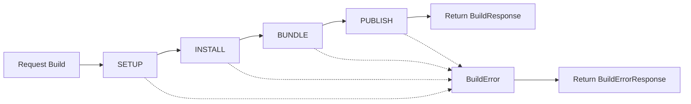

## Introduzione

Il **NPM Build Service** è un servizio Node.js (basato su Fastify) dedicato alla build di artefatti di tipo **MODULE** e **COMPONENT**. Questo servizio:

- Risolve le dipendenze npm dichiarate nell'artefatto
- Esegue la build tramite esbuild
- Genera pacchetti npm riutilizzabili dal runtime
- Espone REST API per Publisher e Registry API
- Non utilizza npm workspaces nel repository (scelta architetturale per isolamento)

## Architettura

### Stack Tecnologico

- **Node.js** (TypeScript 5.6.2)
- **Fastify** 5.2.0: Framework HTTP performante
- **esbuild** 0.24.2: Bundler ultra-veloce
- **slugify** 1.6.6: Normalizzazione nomi pacchetti
- **Vitest** 2.1.4: Test framework

### API Endpoint

#### POST /api/build

Esegue la build di un artefatto MODULE o COMPONENT.

**Request Body:**

```typescript
interface BuildRequest {
  tenantId: string;
  artifactId: string;
  versionId: string;
  artifactTitle: string;
  artifactType: 'MODULE' | 'COMPONENT';
  version: string;
  sourceCode: string;
  npmDependencies: Record<string, string>;
  components?: ComponentSource[];
}

interface ComponentSource {
  artifactId: string;
  title: string;
  sourceCode: string;
}
```

**Response (Success):**

```typescript
interface BuildResponse {
  success: true;
  npmPackageRef: string;
  packageName: string;
  packageVersion: string;
  buildDurationMs: number;
  bundleSizeBytes: number;
}
```

**Response (Error):**

```typescript
interface BuildErrorResponse {
  success: false;
  error: string;
  phase: 'SETUP' | 'INSTALL' | 'BUNDLE' | 'PUBLISH';
  details?: string;
}
```

#### GET /api/health

Health check endpoint per verificare che il servizio sia operativo.

**Response:**

```json
{
  "status": "UP",
  "service": "npm-build-service"
}
```

## Flusso di Build

Il servizio implementa un orchestrator di build che esegue le seguenti fasi:



### Fasi di Build

1. **SETUP**: Creazione directory temporanea, generazione package.json e tsconfig.json
2. **INSTALL**: Installazione delle dipendenze npm (npm install)
3. **BUNDLE**: Bundling del codice con esbuild (ESM, browser target) e tentativo best-effort di generazione `.d.ts` via `tsc`
4. **PUBLISH**: Pubblicazione del pacchetto npm su Nexus (`npm publish`)

### Gestione Componenti (solo MODULE)

Per artefatti di tipo **MODULE**, il servizio:

- Riceve l'elenco dei componenti (`components[]`)
- Crea una struttura di sottodirectory per ogni componente
- Genera un `index.ts` che esporta tutti i componenti
- Include i componenti nel bundle finale

## Configurazione

### Variabili d'Ambiente

- `PORT`: Porta su cui il servizio ascolta (default: 8090)
- `LOG_LEVEL`: Livello di logging (default: info)
- `NEXUS_URL`: Base URL di Nexus (default: `http://localhost:8070`)
- `NEXUS_NPM_REGISTRY_URL`: URL del repository npm hosted (default: `http://localhost:8070/repository/npm-hosted/`)
- `NEXUS_NPM_GROUP_URL`: URL del repository npm group (default: `http://localhost:8070/repository/npm-group/`)
- `NEXUS_USERNAME`: Username Nexus (default: `admin`)
- `NEXUS_PASSWORD`: Password Nexus (obbligatoria)
- `BUILD_TEMP_DIR`: Directory temporanea build (default: `/tmp/stillum-builds`)
- `BUILD_TIMEOUT_MS`: Timeout install dipendenze (default: `120000`)
- `BUILD_MAX_CONCURRENT`: Parametro previsto per throttling (non ancora applicato nel codice)

### Esempio docker-compose

```yaml
npm-build-service:
  build: ./npm-build-service
  container_name: stillum-npm-build-service
  ports:
    - "8090:8090"
  environment:
    - PORT=8090
    - LOG_LEVEL=info
  networks:
    - stillum-network
```

## Integrazione con Publisher

Il Publisher invoca il NPM Build Service durante il flusso di pubblicazione di artefatti MODULE/COMPONENT:

1. Verifica che l'artefatto sia di tipo MODULE o COMPONENT
2. Invia `sourceCode` e `npmDependencies` al servizio di build
3. Riceve `npmPackageRef` nel caso di successo
4. Include `npmPackageRef` nel bundle di pubblicazione
5. Aggiorna `ArtifactVersion.npm_package_ref` nel database

### Configurazione Publisher

In `publisher/src/main/resources/application.properties`:

```properties
quarkus.rest-client.npm-build-service.url=http://${NPM_BUILD_SERVICE_HOST:localhost}:${NPM_BUILD_SERVICE_PORT:8090}
quarkus.rest-client.npm-build-service.scope=jakarta.enterprise.context.ApplicationScoped
```

## Considerazioni Architetturali

### Perché un servizio dedicato?

La scelta di utilizzare un servizio dedicato invece di npm workspaces nel repository principale è motivata da:

- **Isolamento**: Il servizio di build può essere scalato indipendentemente
- **Sicurezza**: Il codice utente (sourceCode) viene eseguito in un ambiente isolato
- **Flessibilità**: È possibile cambiare il tool di build (es. webpack, rollup) senza impattare il main repo
- **Multi-tenancy**: Ogni build viene eseguita in una directory temporanea isolata per tenant/artefatto/versione

### Performance

- **esbuild**: Bundling ultra-veloce (ordinariamente < 100ms per bundle piccoli)
- **Cache npm**: Le dipendenze vengono installate in directory temporanee, ma il cache npm locale riduce i tempi di installazione
- **Parallelizzazione**: È possibile istanziare più repliche del servizio per build concorrenti

## Test

Il servizio include suite di test con Vitest:

```bash
cd npm-build-service
npm test
```

I test coprono:

- Validazione request/response
- Orchestrazione delle fasi di build
- Gestione errori in ogni fase
- Generazione corretta di package.json e tsconfig.json

## Sviluppo Locale

```bash
cd npm-build-service
npm install
npm run dev
```

Il servizio sarà disponibile su `http://localhost:8090`.

## Note Future

- **Cache di build**: Introdurre caching dei bundle per evitare rebuild di versioni già pubblicate
- **Supporto altri bundler**: Configurabilità per scegliere tra esbuild, webpack, rollup
- **Analisi bundle**: Generazione di report sulle dimensioni e dipendenze
- **Supporto TypeScript/JavaScript puro**: Estendere supporto per artefatti JS non compilati
