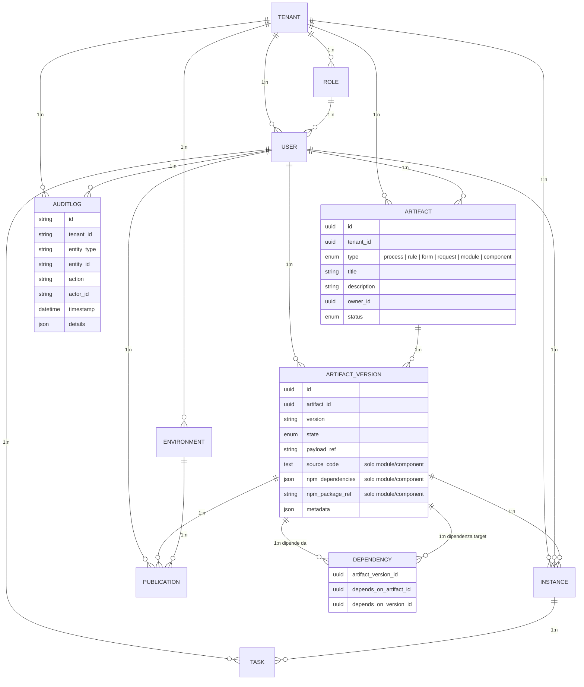

## Introduzione

Questo documento descrive il modello dati preliminare per la piattaforma **Stillum Business Portal**. Il modello è pensato per supportare il multi‑tenant, il versioning degli artefatti e il ciclo di vita definito nella fase di raccolta requisiti. Ogni entità è accompagnata da una breve descrizione e dalle relazioni principali.

## Entità principali

### Tenant

Rappresenta un’istanza separata del sistema (organizzazione o cliente). Tutti gli altri record fanno riferimento a un tenant.

- `id` (uuid): Identificatore univoco.  
- `name` (string): Nome del tenant.  
- `domain` (string): Dominio o identificativo leggibile.  
- `created_at` (datetime): Data di creazione.

### User

Utente del sistema appartenente a un tenant. Ogni utente è associato a un ruolo.

- `id` (uuid)  
- `tenant_id` (uuid) → **Tenant**.  
- `role_id` (uuid) → **Role**.  
- `name` (string).  
- `email` (string).  
- `password_hash` (string).  
- `created_at`, `updated_at` (datetime).

### Role

Definisce un insieme di permessi. Permetterà di impostare RBAC a livello di applicazione.

- `id` (uuid).  
- `tenant_id` (uuid) → **Tenant** (in modalità RBAC per tenant).  
- `name` (string).  
- `description` (string).

### Artifact

Rappresenta un artefatto generico (processo BPMN, regola DMN, modulo StillumForms, request, modulo UI React, componente UI React). Contiene solo i metadati generali; i contenuti sono memorizzati nelle versioni.

- `id` (uuid).
- `tenant_id` (uuid) → **Tenant**.
- `type` (enum): {`process`, `rule`, `form`, `request`, `module`, `component`}.
- `title` (string).
- `description` (string).
- `owner_id` (uuid) → **User**.
- `status` (enum): stato corrente (bozza, in revisione, approvato, pubblicato, ritirato).
- `created_at`, `updated_at` (datetime).

> **Nota sui tipi MODULE e COMPONENT:** gli artefatti `form` restano dedicati alla definizione di interfacce StillumForms basate su JSON Schema. I nuovi tipi `module` e `component` consentono di definire pools, droplets e triggers tramite codice React effettivo. Un `module` rappresenta un modulo UI complesso composto da uno o più componenti; un `component` è un singolo elemento UI (pool, droplet o trigger) collegabile a un modulo padre tramite la tabella **Dependency**.

### ArtifactVersion

Versione concreta di un artefatto. Ogni versione fa riferimento al payload memorizzato nello storage oggetti.

- `id` (uuid).
- `artifact_id` (uuid) → **Artifact**.
- `version` (string): numero di versione (es. semver).
- `state` (enum): {`draft`, `review`, `approved`, `published`, `retired`}.
- `payload_ref` (string): puntatore al file in MinIO/S3.
- `source_code` (text, opzionale): codice sorgente React per artefatti di tipo `module` e `component`.
- `npm_dependencies` (json, opzionale): mappa delle dipendenze npm (nome→versione) per artefatti `module`/`component`.
- `npm_package_ref` (string, opzionale): puntatore al pacchetto npm generato dopo la build (per artefatti `module`/`component`).
- `created_by` (uuid) → **User**.
- `created_at` (datetime).
- `metadata` (json): eventuali informazioni aggiuntive.

### Environment

Ambiente di esecuzione (DEV, QA, PROD) configurabile per ogni tenant.

- `id` (uuid).  
- `tenant_id` (uuid) → **Tenant**.  
- `name` (string).  
- `description` (string).

### Publication

Registra la pubblicazione di una versione di un artefatto in uno specifico ambiente.

- `id` (uuid).  
- `artifact_version_id` (uuid) → **ArtifactVersion**.  
- `environment_id` (uuid) → **Environment**.  
- `published_by` (uuid) → **User**.  
- `published_at` (datetime).  
- `notes` (string).

### Instance

Istanza di esecuzione di un processo (workflow) avviata tramite Temporal.

- `id` (uuid).  
- `tenant_id` (uuid) → **Tenant**.  
- `artifact_version_id` (uuid) → **ArtifactVersion** (solo per artefatti di tipo `process`).  
- `correlation_key` (string) e `business_key` (string) per correlazione.  
- `status` (enum): {`running`, `completed`, `failed`, `cancelled`}.  
- `started_at`, `ended_at` (datetime).

### Task

Rappresenta un’unità di lavoro (potenzialmente assegnata a un utente) nell’ambito di un’istanza.

- `id` (uuid).  
- `instance_id` (uuid) → **Instance**.  
- `name` (string).  
- `type` (enum): {`human`, `service`}.  
- `assignee_id` (uuid) → **User** (opzionale).  
- `status` (enum): {`pending`, `in_progress`, `completed`, `failed`}.  
- `due_date`, `created_at`, `updated_at` (datetime).

### AuditLog (opzionale)

Log delle operazioni rilevanti per audit.

- `id` (uuid).  
- `tenant_id` (uuid) → **Tenant**.  
- `entity_type` (string).  
- `entity_id` (uuid).  
- `action` (string).  
- `actor_id` (uuid) → **User**.  
- `timestamp` (datetime).  
- `details` (json).

## Relazioni e schema ER

Di seguito un diagramma ER in notazione mermaid che illustra le relazioni principali tra le entità descritte:

> **Relazione Modulo→Componenti:** un artefatto di tipo `module` può avere N artefatti `component` collegati tramite la tabella `dependency`. Ogni `component` dichiara una dipendenza verso il `module` padre. Il grafo delle dipendenze permette al Publisher di risolvere l'intero albero di componenti per generare il pacchetto npm finale.

## Note sul modello

- Le chiavi primarie sono UUID per garantire unicità anche in contesti distribuiti.
- I campi `created_at` e `updated_at` permettono di tracciare le modifiche nel tempo.
- Il campo `metadata` su **ArtifactVersion** consente di estendere il modello senza modificare lo schema.
- Il modello è pensato per essere implementato in PostgreSQL con politiche di row‑level security basate sul `tenant_id`.
- I campi `source_code`, `npm_dependencies` e `npm_package_ref` su **ArtifactVersion** sono opzionali e pertinenti solo per artefatti di tipo `module` e `component`. Consentono di memorizzare il codice sorgente React, le dipendenze npm necessarie e il riferimento al pacchetto npm generato dalla pipeline di build.
- La tabella **Dependency** gestisce sia le dipendenze tradizionali (es. processo → regola DMN) sia la relazione Modulo→Componenti per gli artefatti React UI.

Questo modello dati costituirà la base per la definizione delle tabelle, delle API REST/gRPC e per il mapping negli ORM utilizzati dalle applicazioni backend.