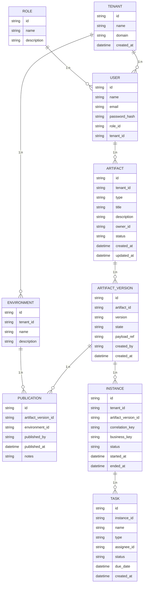

## Obiettivo della fase

La Fase 0 ha l’obiettivo di preparare il terreno per tutte le evoluzioni successive del progetto. In questa fase si raccolgono i requisiti, si definisce il modello dati e si allestisce l’infrastruttura minima per poter avviare lo sviluppo. Non vengono implementate funzionalità di business, ma si stabiliscono le fondamenta sulle quali costruire la piattaforma.

## Analisi dei requisiti e modellazione del dominio

1. **Raccolta dei requisiti**
   - Intervistare gli stakeholder per capire quali artefatti devono essere gestiti (processi BPMN, regole DMN, moduli di form, definizioni di request).  
   - Definire i flussi di pubblicazione e promozione (bozza → revisione → approvazione → pubblicazione).  
   - Raccogliere esigenze relative a multi‑tenant, RBAC, auditing e ambienti (DEV, QA, PROD).
2. **Definizione del modello dati**
   - Identificare le entità principali e le loro relazioni: Tenant, Utente, Ruolo, Artefatto, Versione di artefatto, Ambiente, Pubblicazione, Istanza, Task.  
   - Stabilire i campi chiave per ogni entità (id, foreign key, metadati, timestamp).  
   - Definire le enumerazioni (tipo di artefatto, stato dell’artefatto, stato dell’istanza, tipo di task).  
   - Documentare il modello con un diagramma ER per una visione complessiva.

### Diagramma ER (mermaid)

## Scelta dello stack tecnologico

1. **Database relazionale**: PostgreSQL viene scelto per la sua robustezza, supporto a JSON e funzioni avanzate come le politiche di Row‑Level Security (RLS), necessarie per l’isolamento multi‑tenant.
2. **Object storage**: MinIO viene utilizzato per i payload (XML BPMN, definizioni DMN, JSON di moduli) in ambienti self‑host. In ambienti cloud sarà possibile configurare un bucket S3 mantenendo la stessa API.
3. **Motore di orchestrazione**: Temporal è selezionato come orchestratore dei processi perché supporta workflow duraturi, retry, compensazioni e si integra bene con definizioni BPMN tramite wrapper custom.
4. **Pila frontend**: La UI verrà sviluppata in React con componenti shadcn/ui, editor bpmn.io per i processi, dmn.io per le regole e un editor proprietario StillumForms per i moduli.
5. **Pipeline CI/CD**: Si predispongono pipeline di lint, build e test. In seguito verranno aggiunti step di package (Helm) e deploy.

## Preparazione dell’infrastruttura di sviluppo

1. **Cluster di sviluppo**
   - Installare un cluster k3s o Kubernetes equivalente con i componenti di base.  
   - Deploy di Postgres, MinIO e Temporal tramite Helm charts o manifest YAML personalizzati.  
   - Configurare namespaces separati per isolare ambienti (ad esempio `stillum-dev`).
2. **Repository e struttura del codice**
   - Creare un repository con una suddivisione chiara: `/portal-ui` per il frontend, `/registry-api` per l’API dei metadati, `/publisher` per il servizio di pubblicazione, `/runtime-gateway` per l’interfaccia con Temporal.  
   - Includere standard di codice, pre-commit hooks e file di configurazione (ESLint, Prettier, editorconfig).
3. **Pipeline di CI iniziale**
   - Configurare un workflow (GitHub Actions o similare) che effettui lint, build e test per ogni push.  
   - Preparare step per eseguire migrazioni del database in un ambiente di test.
4. **Documentazione**
   - Aggiornare la documentazione Docusaurus con il modello dati e le decisioni architetturali della Fase 0.  
   - Mantenere tracciate le scelte effettuate (e le alternative scartate) per consultazioni future.

## Deliverable della Fase 0

Al termine della Fase 0 dovranno essere prodotti:

1. **Documento dei requisiti** che elenca le funzionalità richieste, gli stakeholder e le priorità.
2. **Modello dati** documentato con il diagramma ER e descrizione delle entità.
3. **Scelta delle tecnologie** con motivazioni e linee guida per i team di sviluppo.
4. **Ambiente di sviluppo configurato**, comprensivo di cluster, servizi di base (Postgres, MinIO, Temporal) e accessi.
5. **Struttura del repository e pipeline CI** pronte per ospitare il codice delle fasi successive.

Questi deliverable costituiscono le fondamenta operative su cui costruire la piattaforma Stillum Business Portal. Una volta completati, si potrà procedere con l’implementazione dell’MVP backend (Fase 1) e dei componenti frontend (Fase 2).